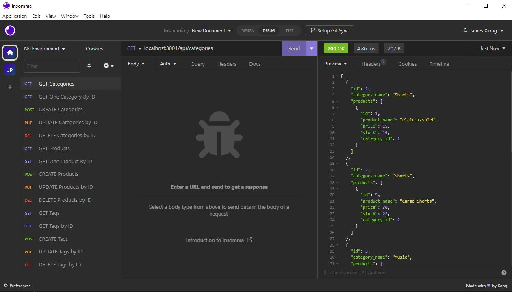
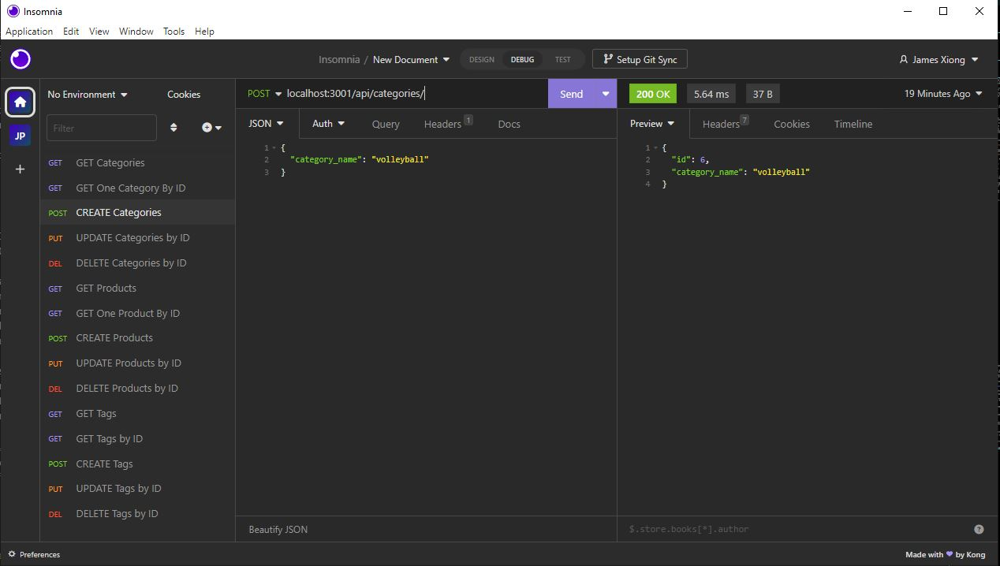
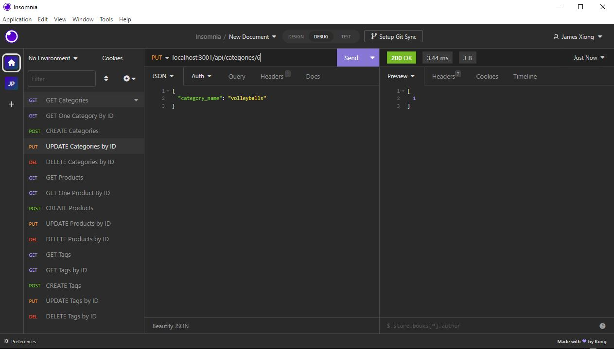
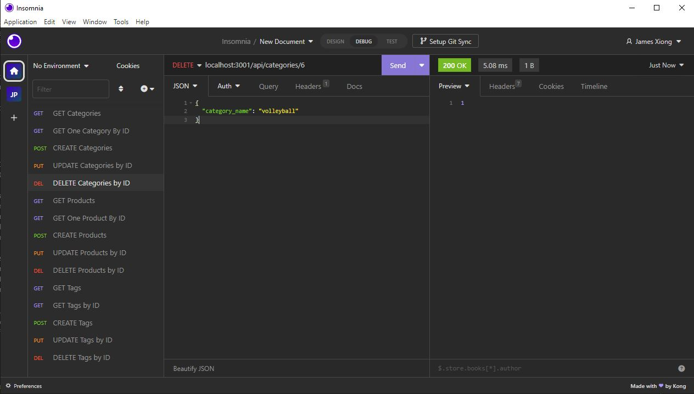

# Awesome-Retail-App

## Description

In this project, I was required to create a backend Retail app through a local server in express. You can view, add, delete, and update catgegories, products, and their tags.  

## Usage

This app requires the use of Node.js and MySQL in VSCode!

* First, clone the files into a directory.

* Then, enter your terminal and run 'npm i' to install node.js and the dependencies.

* After that, make sure you edit the '.env' file to contain the correct username and password for MySQL.

* Next, run 'mysql -u root -p' and source the .sql file by typing 'source ./db/schema.sql;' and 'node /seeds/index.js' to seed the database

* Finally, back out of MySQL by pressing 'CTRL + C' and run 'npm start' to start the backend app.

## Screenshot of GET

## Screenshot of POST

## Screenshot of PUT

## Screenshot of DELETE

## Video Demo

Here is a link to my video demo!

https://drive.google.com/file/d/1bmyZ6SaiZnGGggAYFP9HOtO2EBTpyWjj/view
